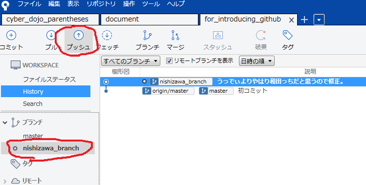
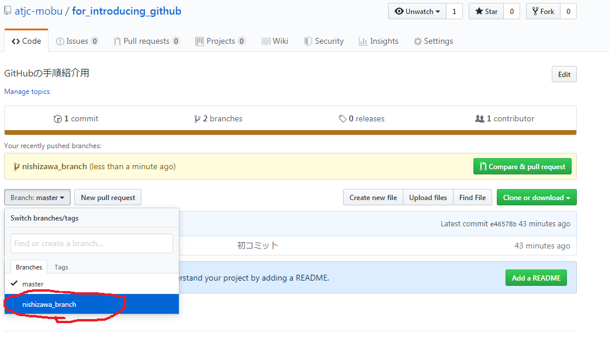

## Sourcetree便利!
https://ja.atlassian.com/software/sourcetree

## 手順
### 0.やりたいこと
↓のリポジトリーのMain.javaを修正したい。

https://github.com/atjc-mobu/for_introducing_github

### 1.リポジトリをクローン

1. Sourcetreeのタブの"+"をクリック

2. Remoteをクリック

3. GitHubのアカウント選択

4. クローンしたいリポジトリ(今回はfor_introducing_github)のCloneをクリック

5. クローンクリック

### 2.ブランチを作ろう！

1. ブランチをクリック

2. 新規ブランチ項目に任意のブランチ名を設定

3. ブランチを作成をクリック

### 3.ファイルを修正しよう！

1. '2'で作成したブランチを選択してExplorerをクリック
→対象のフォルダが開かれる

2. ファイルの修正、追加、削除などなどを行う
今回はMain.javaを修正

### 4.修正をコミットしよう！

1. Sourcetreeを見ると"コミットされていない変更があります"と表示されている。ので選択

2. "作業ツリーのファイル"内のMain.java横の"+"ボタンをクリック

3. "Indexにステージしたファイル"内にMain.javaが移動したことを確認

4. ファイルの修正内容を確認

5. コミットをクリック

6. コミットメッセージを記載

7. コミットボタンをクリック

### 5.プッシュしよう！

1. 修正したブランチを選択して、プッシュをクリック

2. ローカルブランチの修正したブランチを選択

3. プッシュをクリック

### 6.修正した内容をGitHubで確認

1. GitHubで該当のリポジトリにアクセスすると今回作成したブランチが存在することがわかる。
今回のリポジトリは
https://github.com/atjc-mobu/for_introducing_github

2. 修正したブランチを選択して、"Compare&pull request"を選択すると、差分が見れる。

### 7.プルリクエストを送ろう！

1. '6'で確認した"Compare&pull request"をクリックした画面を開く

2. タイトルを記述

3. 修正内容の詳細を記述

4. Reviewersをクリックして見てもらいたい人を選択

5. Create pull requestをクリック

### 8.プルリクエストを確認しよう！

1. 修正したリポジトリのページのPull requestsをクリック

2. 作成したプルリクエストが存在することが確認できます

### 9.プルリクエストの内容をレビューしよう！
この手順は他の人がプルリクを行ったときにする手順です。

1. プルリク対象のリポジトリのページのPull requestをクリックし、対象のプルリクを選択します。

2. 修正内容の差分を見るためにFiles changesをクリック

3. (1)【この修正を承認する場合】
Review changesをクリックし、Approveを選択、Submit reviewをクリック

3. (2)【修正に物申したいとき、質問したいとき】
その箇所にカーソルを当て"+"ボタンをクリックする。
内容を記載し、Start a reviewをクリック。(おそらく質問とかの場合はAdd single commentだと思う)
その後、Finish your reviewをクリック、Request changesを選択、Submit reviewをクリック。

### 10.修正の提案の対応をしよう！

1. 自分のプルリクにコメントが入ったら、内容を確認して対応しよう。

2. (1)【コメントに対して修正する意味がないと思えるとき・コメントの意図がわからないとき】
来たコメントに対して、そのことを書こう。

3. (2)【修正が必要だと思ったら】
'3'~'5'の手順でファイルを修正しよう。
そして、修正した旨をコメントしよう。

### 11.ブランチをマージしよう！
レビューしてもらいたい人全員がapprove(承認)したら、管理者がブランチをマージしよう。

1. 該当のプルリクを選択し、ページ内のMerge pull requestをクリック

2. Confirm mergeをクリック

3. 修正していたブランチを削除するために、Delete branchをクリック

4. リポジトリページで修正内容が反映されていることを確認

